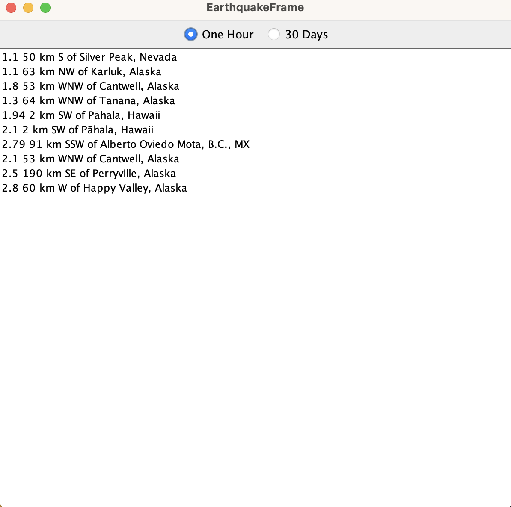
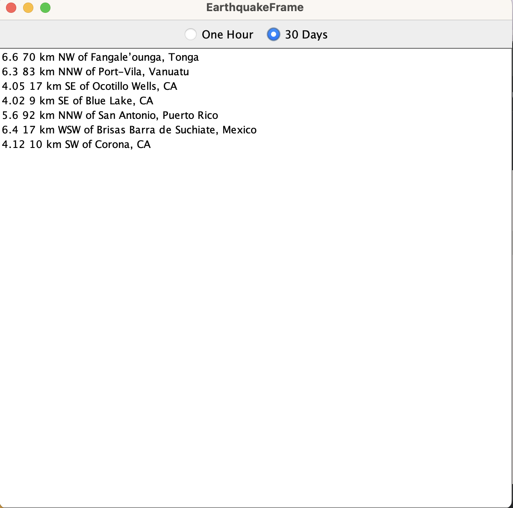

#Title "Weather Data"

This project extends the existing earthquake monitoring application to include a new feature that requests the most significant earthquakes in the last 30 days, accompanied by a corresponding unit test. Additionally, the UI is enhanced with radio buttons to switch between recent and significant earthquake data, and a feature that opens Google Maps with the earthquake's location when a list item is clicked.